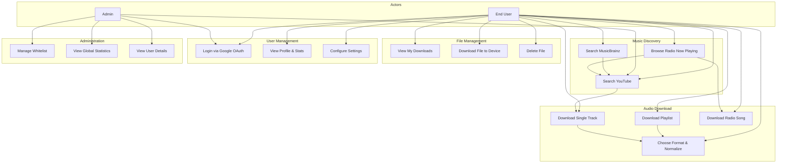
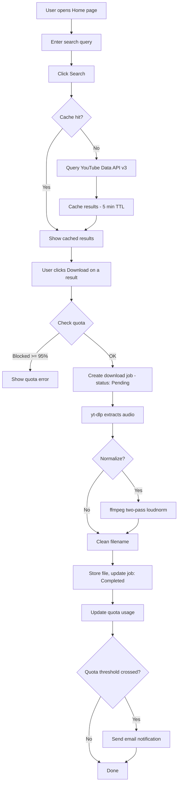
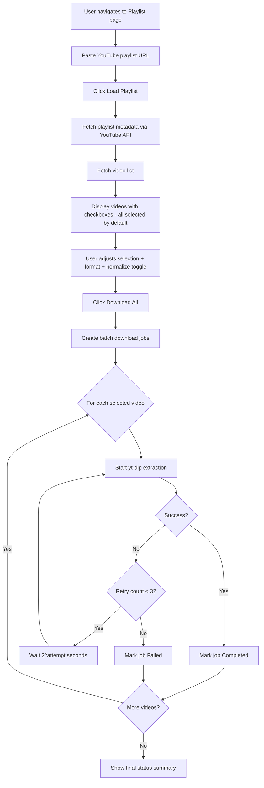
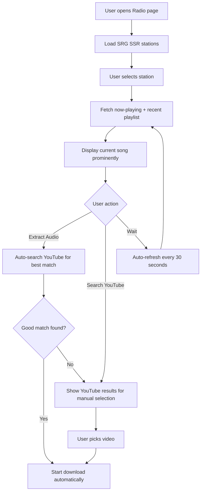
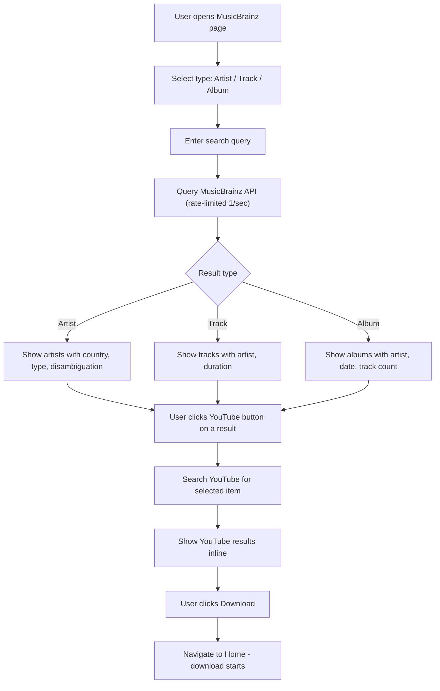
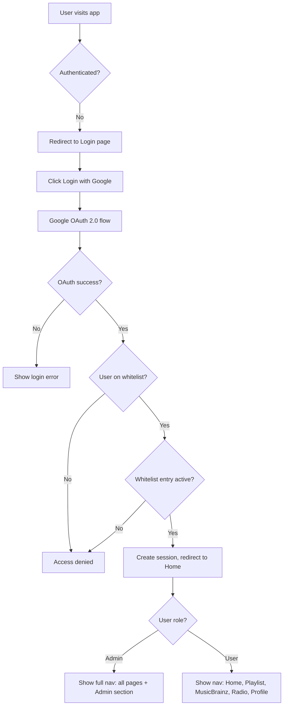
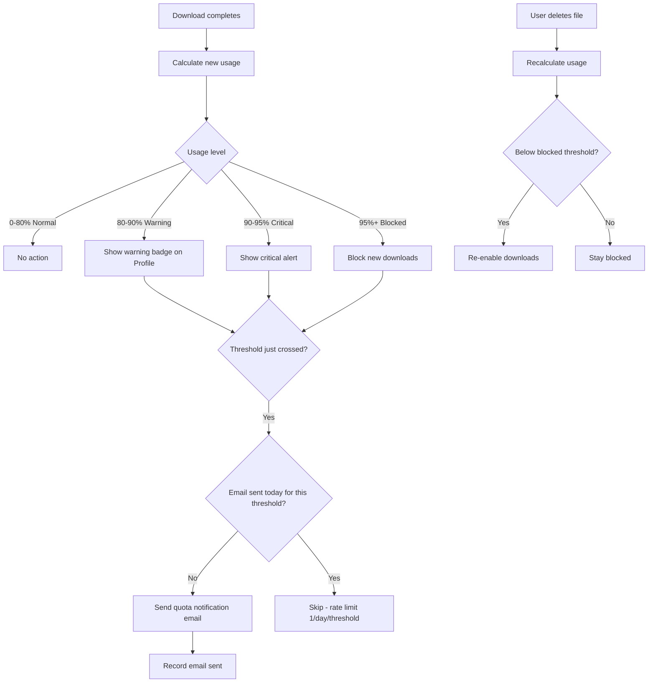
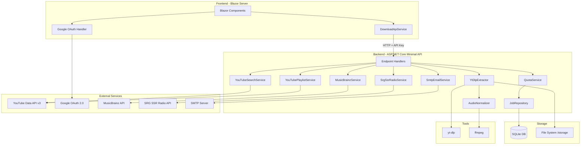
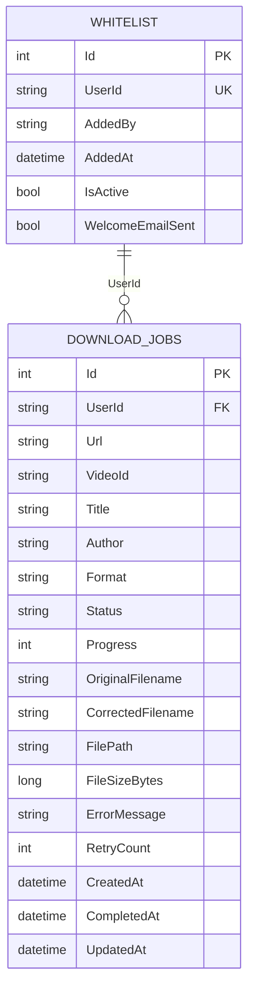

# Product Requirements Document: MusicGrabber

## 1. Overview

**Product Name:** MusicGrabber
**Version:** 1.0
**Date:** 2026-03-21

### 1.1 Vision

A self-hosted web application for personal music collection management that lets whitelisted users search, discover, and download audio from YouTube — with metadata enrichment from MusicBrainz and live radio integration from Swiss SRG SSR stations.

### 1.2 Problem Statement

Music enthusiasts who want to build personal audio libraries face fragmented tooling: CLI-only tools like yt-dlp require technical skill, there's no unified way to discover music across YouTube, MusicBrainz, and live radio, and multi-user household setups lack quota management or access controls.

### 1.3 Target Users

| Persona | Description |
|---------|-------------|
| **End User** | Whitelisted user who searches, discovers, and downloads music |
| **Admin** | Manages user access (whitelist), monitors system usage and quotas |

### 1.4 Success Metrics

- Users can go from search to downloaded audio file in under 60 seconds
- Playlist batch downloads complete with retry resilience (up to 3 retries)
- Per-user storage stays within quota via automated threshold enforcement
- Admin has full visibility into system usage without SSH access

---

## 2. Use Cases

### 2.1 Use Case Diagram



### 2.2 Use Case Details

#### UC1: Search YouTube
- **Actor:** End User
- **Precondition:** User is authenticated and whitelisted
- **Flow:** User enters search query → System queries YouTube Data API v3 → Results displayed with title, author, duration, thumbnail
- **Cache:** Results cached for 5 minutes to reduce API quota

#### UC2: Search MusicBrainz
- **Actor:** End User
- **Flow:** User selects search type (Artist / Track / Album) → Enters query → System queries MusicBrainz API (rate-limited 1 req/sec) → Results displayed → User can pivot to YouTube search for any result

#### UC3: Browse Radio Now Playing
- **Actor:** End User
- **Flow:** User selects SRG SSR radio station → System shows currently playing song + recent playlist (auto-refreshes every 30s) → User can extract audio or search YouTube for the song

#### UC4: Download Single Track
- **Actor:** End User
- **Precondition:** Quota not blocked (< 95% used)
- **Flow:** User clicks Download on a YouTube result → System creates download job → yt-dlp extracts audio → Optional normalization via ffmpeg → File stored, job marked complete

#### UC5: Download Playlist
- **Actor:** End User
- **Flow:** User pastes YouTube playlist URL → System loads playlist metadata + video list → User selects/deselects videos, chooses format → Batch download jobs created → Retry up to 3x with exponential backoff on failure

#### UC6: Download Radio Song
- **Actor:** End User
- **Flow:** User clicks Extract Audio on now-playing song → System auto-searches YouTube for best match → Downloads audio → Falls back to manual YouTube selection if no good match

#### UC7: Choose Format & Normalize
- **Actor:** End User
- **Options:** MP3 (default), FLAC, M4A
- **Normalization:** Optional two-pass ffmpeg loudnorm (EBU R128, target -14 LUFS)

#### UC8-UC10: File Management
- View completed downloads with title, artist, size, status
- Download files to local device
- Delete files (removes from disk + database, frees quota)

#### UC11: Login via Google OAuth
- **Flow:** User clicks Login → Redirected to Google → On success, checked against whitelist → If whitelisted and active, session created → If not whitelisted, access denied

#### UC12-UC13: Profile & Settings
- View account info, storage quota (visual progress bar with threshold alerts), top artists, download history
- Configure: default format, normalization on/off + target LUFS, email notifications

#### UC14: Manage Whitelist
- **Actor:** Admin only
- **Flow:** Search users, add by email (with optional welcome email), toggle active/disabled, remove users
- Confirmation dialog on destructive actions

#### UC15-UC16: Statistics
- **Actor:** Admin only
- Global: total downloads, storage used, active users (7d), success rate, status distribution, downloads-per-day trend
- Per-user drill-down: downloads, storage, success rate, top artists

---

## 3. Workflows

### 3.1 Search-to-Download Flow



### 3.2 Playlist Download Flow



### 3.3 Radio Discovery Flow



### 3.4 MusicBrainz Discovery Flow



### 3.5 Authentication & Authorization Flow



### 3.6 Quota Management Flow



---

## 4. Screen Wireframes

### 4.1 Navigation Layout

```
┌──────────────────────────────────────────────────────────────────────┐
│  MusicGrabber                    [Home] [Playlist] [MusicBrainz]    │
│                                  [Radio] [Profile] [Admin v]  [Logout]│
├──────────────────────────────────────────────────────────────────────┤
│                                                                      │
│                         << Page Content >>                           │
│                                                                      │
└──────────────────────────────────────────────────────────────────────┘
```

### 4.2 Home Page — Search & Downloads

```
┌──────────────────────────────────────────────────────────────────────┐
│  Music Downloader                                                    │
│  Search and download music from YouTube                              │
│                                                                      │
│  ┌─ Search YouTube ────────────────────────────────────────────────┐ │
│  │                                                                  │ │
│  │  [______________________________] [  Search  ]                   │ │
│  │   Search for songs, artists...                                   │ │
│  │                                                                  │ │
│  │  ┌─────────────────────────────────────────────────────────┐    │ │
│  │  │ Bohemian Rhapsody - Official Video                      │    │ │
│  │  │ Queen · 5:55                              [ Download ]  │    │ │
│  │  ├─────────────────────────────────────────────────────────┤    │ │
│  │  │ Bohemian Rhapsody (Remastered 2011)                     │    │ │
│  │  │ Queen · 5:54                              [ Download ]  │    │ │
│  │  ├─────────────────────────────────────────────────────────┤    │ │
│  │  │ Bohemian Rhapsody - Live at Wembley                     │    │ │
│  │  │ Queen · 5:38                              [ Download ]  │    │ │
│  │  └─────────────────────────────────────────────────────────┘    │ │
│  └──────────────────────────────────────────────────────────────────┘ │
│                                                                      │
│  ┌─ Your Downloads ────────────────────────────────────────────────┐ │
│  │                                                                  │ │
│  │  Title              │ Artist │ Size    │ Status    │ Actions     │ │
│  │  ───────────────────┼────────┼─────────┼───────────┼──────────── │ │
│  │  Bohemian Rhapsody  │ Queen  │ 8.2 MB  │ Available │ [Delete]   │ │
│  │  Under Pressure     │ Queen  │ 6.1 MB  │ Available │ [Delete]   │ │
│  │  Don't Stop Me Now  │ Queen  │ 5.4 MB  │ Available │ [Delete]   │ │
│  │                                                                  │ │
│  └──────────────────────────────────────────────────────────────────┘ │
└──────────────────────────────────────────────────────────────────────┘
```

### 4.3 Playlist Download Page

```
┌──────────────────────────────────────────────────────────────────────┐
│  Playlist Download                                                   │
│  Download entire YouTube playlists                                   │
│                                                                      │
│  ┌─ Enter Playlist URL ───────────────────────────────────────────┐ │
│  │  [https://youtube.com/playlist?list=...____] [ Load Playlist ] │ │
│  └────────────────────────────────────────────────────────────────┘ │
│                                                                      │
│  ┌─ Queen Greatest Hits ──────────────────────────────── [thumb] ─┐ │
│  │  by Queen Official · 20 videos                                  │ │
│  │                                                                  │ │
│  │  Format: [MP3 v]   [x] Normalize Audio                         │ │
│  │  [ Download All (18 selected) ]  [Select All] [Deselect All]   │ │
│  │                                                                  │ │
│  │  ┌─ Storage: 45% used (450 MB / 1000 MB) ───────────────────┐ │ │
│  │  │  ████████████░░░░░░░░░░  Est. needed: 180 MB             │ │ │
│  │  └──────────────────────────────────────────────────────────┘ │ │
│  │                                                                  │ │
│  │  Videos (20)                                                     │ │
│  │  ┌───┬────┬───────────┬──────────────────────┬────────┬──────┐ │ │
│  │  │[x]│ #  │ Thumbnail │ Title                │Channel │ Act  │ │ │
│  │  ├───┼────┼───────────┼──────────────────────┼────────┼──────┤ │ │
│  │  │[x]│  1 │ [img]     │ Bohemian Rhapsody    │ Queen  │ [DL] │ │ │
│  │  │[x]│  2 │ [img]     │ Under Pressure       │ Queen  │ [DL] │ │ │
│  │  │[ ]│  3 │ [img]     │ We Will Rock You     │ Queen  │ [DL] │ │ │
│  │  │[x]│  4 │ [img]     │ Don't Stop Me Now    │ Queen  │ [DL] │ │ │
│  │  └───┴────┴───────────┴──────────────────────┴────────┴──────┘ │ │
│  └──────────────────────────────────────────────────────────────────┘ │
│                                                                      │
│  ┌─ Download Progress ─────────────────────────────────────────────┐ │
│  │  Bohemian Rhapsody     Downloading   [██████████░░░░] 72%      │ │
│  │  Under Pressure        Pending       [░░░░░░░░░░░░░░]  0%      │ │
│  └──────────────────────────────────────────────────────────────────┘ │
└──────────────────────────────────────────────────────────────────────┘
```

### 4.4 MusicBrainz Search Page

```
┌──────────────────────────────────────────────────────────────────────┐
│  MusicBrainz Search                                                  │
│  Search for artists, tracks, and albums, then find them on YouTube   │
│                                                                      │
│  ┌─ Search MusicBrainz ───────────────────────────────────────────┐ │
│  │  [______________________________]                                │ │
│  │                                                                  │ │
│  │  ( Artist )  ( Track )  ( Album )                               │ │
│  │                                                                  │ │
│  │  [ Search MusicBrainz ]  [ Clear ]                              │ │
│  └──────────────────────────────────────────────────────────────────┘ │
│                                                                      │
│  ┌─ Results for "Radiohead" ─────────────────────── 12 found ─────┐ │
│  │                                                                  │ │
│  │  Artists                                                         │ │
│  │  ┌─────────────────────────────────────────────────────────┐    │ │
│  │  │ Radiohead                                                │    │ │
│  │  │ [GB] [Group]                          [ YouTube ]        │    │ │
│  │  ├─────────────────────────────────────────────────────────┤    │ │
│  │  │ Radiohead Tribute Band                                   │    │ │
│  │  │ [US] [Group] tribute/cover band       [ YouTube ]        │    │ │
│  │  └─────────────────────────────────────────────────────────┘    │ │
│  └──────────────────────────────────────────────────────────────────┘ │
│                                                                      │
│  ┌─ YouTube Results for "Radiohead" ──────────────────── [Close] ─┐ │
│  │  ┌────────┬─────────────────────────────────────┬──────────┐   │ │
│  │  │ [thumb]│ Radiohead - Creep (Official Video)  │[Download]│   │ │
│  │  │        │ Radiohead · 3:58                    │          │   │ │
│  │  ├────────┼─────────────────────────────────────┼──────────┤   │ │
│  │  │ [thumb]│ Radiohead - Karma Police            │[Download]│   │ │
│  │  │        │ Radiohead · 4:24                    │          │   │ │
│  │  └────────┴─────────────────────────────────────┴──────────┘   │ │
│  └──────────────────────────────────────────────────────────────────┘ │
└──────────────────────────────────────────────────────────────────────┘
```

### 4.5 Radio Now Playing Page

```
┌──────────────────────────────────────────────────────────────────────┐
│  Radio Now Playing                                                   │
│  See what's playing on Swiss radio stations and extract audio         │
│                                                                      │
│  ┌─ Select Station ───────────────────────────────────────────────┐ │
│  │  [  Radio SRF 1  ]  [ *Radio SRF 3* ]  [  Radio SRF Virus  ] │ │
│  └──────────────────────────────────────────────────────────────────┘ │
│                                                                      │
│  ┌─ NOW PLAYING on Radio SRF 3 ──────────────────────────────────┐ │
│  │                                                                  │ │
│  │     Bohemian Rhapsody                                 ┌──────┐ │ │
│  │     Queen                                             │      │ │ │
│  │                                                        │  ♪♪  │ │ │
│  │     [5:55]  [Started: 14:32]                          │      │ │ │
│  │                                                        └──────┘ │ │
│  │     [ Extract Audio ]  [ Search YouTube ]                       │ │
│  │                                                                  │ │
│  └──────────────────────────────────────────────────────────────────┘ │
│                                                                      │
│  ┌─ Recent Playlist ──────────────────────────── 20 songs ────────┐ │
│  │  ┌─────────────────────────────────────────────────────────┐   │ │
│  │  │ Under Pressure                                           │   │ │
│  │  │ Queen · 14:26                             [DL] [Search] │   │ │
│  │  ├─────────────────────────────────────────────────────────┤   │ │
│  │  │ Don't Stop Me Now                                        │   │ │
│  │  │ Queen · 14:22                             [DL] [Search] │   │ │
│  │  └─────────────────────────────────────────────────────────┘   │ │
│  └──────────────────────────────────────────────────────────────────┘ │
│                                                                      │
│  ┌─── YouTube Results for "Queen Bohemian Rhapsody" ─── [Close] ──┐ │
│  │  (modal overlay with YouTube search results + download buttons) │ │
│  └────────────────────────────────────────────────────────────────┘ │
└──────────────────────────────────────────────────────────────────────┘
```

### 4.6 Profile Page

```
┌──────────────────────────────────────────────────────────────────────┐
│  My Profile                                                          │
│                                                                      │
│  ┌─ Account Info ─────┐  ┌──────────────────────────────────────┐   │
│  │                     │  │  ┌──────┐  ┌──────┐  ┌───────────┐  │   │
│  │       [avatar]      │  │  │  42  │  │  38  │  │ 2026-03-20│  │   │
│  │                     │  │  │Total │  │ Done │  │Last Active│  │   │
│  │     Dev User        │  │  └──────┘  └──────┘  └───────────┘  │   │
│  │  dev@example.com    │  │                                      │   │
│  │    [Admin]          │  │  ┌─ Default Settings ──────────────┐ │   │
│  │  Since: 2026-02-20  │  │  │  Format:  [MP3 v]              │ │   │
│  │                     │  │  │  [x] Normalize  [-14 LUFS ──]  │ │   │
│  ├─ Storage ───────────┤  │  │  [x] Email Notifications       │ │   │
│  │                     │  │  │                                 │ │   │
│  │       45%           │  │  │  [ Save Settings ]              │ │   │
│  │  450 MB / 1000 MB   │  │  └─────────────────────────────────┘ │   │
│  │  ████████░░░░░░░░░  │  │                                      │   │
│  │  12 files stored    │  │  ┌─ Recent Activity ───────────────┐ │   │
│  │  550 MB remaining   │  │  │  Top Artists                    │ │   │
│  │                     │  │  │  Queen              8 downloads │ │   │
│  │                     │  │  │  Radiohead           5 downloads │ │   │
│  │                     │  │  │  Pink Floyd          3 downloads │ │   │
│  │                     │  │  │                                 │ │   │
│  │                     │  │  │  Downloads (Last 30 Days)       │ │   │
│  │                     │  │  │  2026-03-20          4          │ │   │
│  │                     │  │  │  2026-03-19          2          │ │   │
│  └─────────────────────┘  │  └─────────────────────────────────┘ │   │
│                            └──────────────────────────────────────┘   │
└──────────────────────────────────────────────────────────────────────┘
```

### 4.7 Admin — Whitelist Management

```
┌──────────────────────────────────────────────────────────────────────┐
│  Whitelist Management                                                │
│  Manage which users are allowed to access the application            │
│                                                                      │
│  ┌─ Search & Actions ──────────────────────── Total: 5 users ─────┐ │
│  │  [______________________________]                  [+ Add User] │ │
│  └──────────────────────────────────────────────────────────────────┘ │
│                                                                      │
│  ┌─ Whitelisted Users ─────────────────────────────────────────────┐ │
│  │                                                                  │ │
│  │  Email            │ Added      │ Added By     │ Status  │ Act   │ │
│  │  ─────────────────┼────────────┼──────────────┼─────────┼────── │ │
│  │  alice@mail.com   │ 2026-01-15 │ admin@co.com │ Active  │[T][X] │ │
│  │  bob@mail.com     │ 2026-02-01 │ admin@co.com │ Active  │[T][X] │ │
│  │  carol@mail.com   │ 2026-03-10 │ admin@co.com │Disabled │[T][X] │ │
│  │                                                                  │ │
│  └──────────────────────────────────────────────────────────────────┘ │
│                                                                      │
│  ┌─── Add User (modal) ──────────────────────────────────────────┐  │
│  │  Email or User ID: [user@example.com___________]              │  │
│  │  [x] Send welcome email                                       │  │
│  │                                  [ Cancel ]  [ Add to List ]  │  │
│  └────────────────────────────────────────────────────────────────┘  │
│                                                                      │
│  ┌─── Remove User? (modal) ──────────────────────────────────────┐  │
│  │  Are you sure you want to remove alice@mail.com?              │  │
│  │  This will prevent them from accessing the application.       │  │
│  │                                    [ Cancel ]  [ Remove ]     │  │
│  └────────────────────────────────────────────────────────────────┘  │
└──────────────────────────────────────────────────────────────────────┘
```

### 4.8 Admin — Statistics Dashboard

```
┌──────────────────────────────────────────────────────────────────────┐
│  Admin Statistics                                                    │
│  Overview of system usage and download statistics                    │
│                                                                      │
│  ┌──────────┐  ┌──────────┐  ┌───────────┐  ┌────────────┐         │
│  │   1,247  │  │ 12.4 GB  │  │    8      │  │   91.2%    │         │
│  │  Total   │  │ Storage  │  │ Active    │  │  Success   │         │
│  │Downloads │  │  Used    │  │Users (7d) │  │   Rate     │         │
│  └──────────┘  └──────────┘  └───────────┘  └────────────┘         │
│                                                                      │
│  ┌─ Download Status Distribution ──────────────────────────────────┐ │
│  │  [Completed] 1,137   [Failed] 82   [Pending] 18   [DL'ing] 10 │ │
│  └──────────────────────────────────────────────────────────────────┘ │
│                                                                      │
│  ┌─ Downloads Per Day (Last 30 Days) ──────────────────────────────┐ │
│  │  2026-03-21    12   ████████████                                │ │
│  │  2026-03-20    18   ██████████████████                          │ │
│  │  2026-03-19     8   ████████                                    │ │
│  │  2026-03-18    22   ██████████████████████                      │ │
│  └──────────────────────────────────────────────────────────────────┘ │
│                                                                      │
│  ┌─ User Statistics ───────────────────────────────────────────────┐ │
│  │  User ID  │ Total │ Storage  │ Done  │ Fail │ Last Active │ Act│ │
│  │  ─────────┼───────┼──────────┼───────┼──────┼─────────────┼────│ │
│  │  alice... │   312 │  3.2 GB  │  298  │   14 │  2026-03-21 │[i]│ │
│  │  bob...   │   189 │  1.8 GB  │  180  │    9 │  2026-03-20 │[i]│ │
│  └──────────────────────────────────────────────────────────────────┘ │
│                                                                      │
│  ┌─── User Details: alice@mail.com (modal) ──────────────────────┐  │
│  │  ┌──────┐  ┌──────┐  ┌────────┐                              │  │
│  │  │ 312  │  │3.2GB │  │ 95.5%  │                              │  │
│  │  │Total │  │Stored│  │Success │                              │  │
│  │  └──────┘  └──────┘  └────────┘                              │  │
│  │                                                               │  │
│  │  Top Artists                                                  │  │
│  │  Queen                                        42 downloads   │  │
│  │  Radiohead                                    28 downloads   │  │
│  │  Pink Floyd                                   19 downloads   │  │
│  │                                                    [ Close ] │  │
│  └───────────────────────────────────────────────────────────────┘  │
└──────────────────────────────────────────────────────────────────────┘
```

### 4.9 Login Page

```
┌──────────────────────────────────────────────────────────────────────┐
│                                                                      │
│                                                                      │
│                         MusicGrabber                                 │
│                                                                      │
│                  ┌──────────────────────────┐                        │
│                  │                          │                        │
│                  │   [ Login with Google ]  │                        │
│                  │                          │                        │
│                  │   Access requires an     │                        │
│                  │   active whitelist       │                        │
│                  │   entry from an admin.   │                        │
│                  │                          │                        │
│                  └──────────────────────────┘                        │
│                                                                      │
└──────────────────────────────────────────────────────────────────────┘
```

---

## 5. Architecture

### 5.1 System Architecture



### 5.2 Data Model



---

## 6. Technical Requirements

### 6.1 Tech Stack

| Layer | Technology |
|-------|-----------|
| Frontend | Blazor Server (.NET 10), Bootstrap 5 |
| Backend API | ASP.NET Core Minimal API (.NET 10) |
| Database | SQLite |
| Audio Extraction | yt-dlp |
| Audio Processing | ffmpeg (EBU R128 loudnorm) |
| Authentication | Google OAuth 2.0 |
| Email | SMTP |
| Containerization | Docker, Docker Compose |
| CI/CD | GitHub Actions |

### 6.2 Non-Functional Requirements

| Requirement | Target |
|-------------|--------|
| YouTube search cache TTL | 5 minutes |
| MusicBrainz rate limit | 1 request/second |
| Radio refresh interval | 30 seconds |
| Default storage quota | 1 GB per user |
| Download retry attempts | 3 (exponential backoff: 2^n seconds) |
| Normalization target | -14 LUFS (EBU R128) |
| Email rate limit | 1 per day per quota threshold |
| Supported audio formats | MP3, FLAC, M4A |

### 6.3 Configuration

| Variable | Purpose |
|----------|---------|
| `YOUTUBE_API_KEY` | YouTube Data API v3 access |
| `GOOGLE_CLIENT_ID` | OAuth client identifier |
| `GOOGLE_CLIENT_SECRET` | OAuth client secret |
| `API_KEY` | Internal service-to-service auth |
| `SMTP_HOST`, `SMTP_PORT`, `SMTP_PASSWORD` | Email notifications |
| `DEV_EMAIL`, `DEV_NAME`, `DEV_ROLE` | Development auth fallback |

### 6.4 Deployment

- **Development:** `docker-compose up --build` (or `dotnet run` locally)
- **Production:** `docker-compose.prod.yml` with persistent volumes
  - Frontend: port 8086
  - Backend API: port 8085
  - Volumes: `/storage` (audio files), `/data` (SQLite database)
  - Health checks on API endpoint

---

## 7. API Surface

| Endpoint | Method | Description |
|----------|--------|-------------|
| `/api/health` | GET | Version + service status |
| `/api/search/youtube?q=` | GET | Search YouTube videos |
| `/api/download/start` | POST | Create download job |
| `/api/download/status/{id}` | GET | Job progress |
| `/api/jobs/{userId}` | GET | User's job list |
| `/api/files/{userId}` | GET | Completed downloads |
| `/api/files/{userId}/download/{jobId}` | GET | Download file |
| `/api/files/{userId}/{jobId}` | DELETE | Delete file |
| `/api/playlist/info?url=` | GET | Playlist metadata |
| `/api/playlist/videos?playlistId=` | GET | Playlist video list |
| `/api/playlist/download` | POST | Batch download |
| `/api/search/musicbrainz?type=&q=` | GET | MusicBrainz search |
| `/api/musicbrainz/artist/{id}` | GET | Artist details |
| `/api/radio/stations` | GET | Radio station list |
| `/api/radio/playlist?station=&limit=` | GET | Recent playlist |
| `/api/radio/now-playing?station=` | GET | Current song |
| `/api/radio/download-current` | POST | Download now-playing |
| `/api/quota/{userId}` | GET | Quota info |
| `/api/quota/{userId}/check?fileSizeBytes=` | GET | Pre-download check |
| `/api/admin/stats/global` | GET | Global statistics |
| `/api/admin/stats/users` | GET | All user stats |
| `/api/admin/stats/users/{userId}` | GET | User detail stats |
| `/api/admin/whitelist` | GET | Whitelist entries |
| `/api/admin/whitelist` | POST | Add to whitelist |
| `/api/admin/whitelist/{id}` | PUT | Toggle status |
| `/api/admin/whitelist/{id}` | DELETE | Remove entry |
| `/api/user/profile/{userId}` | GET | User profile |
| `/api/user/settings/{userId}` | GET/PUT | User preferences |
