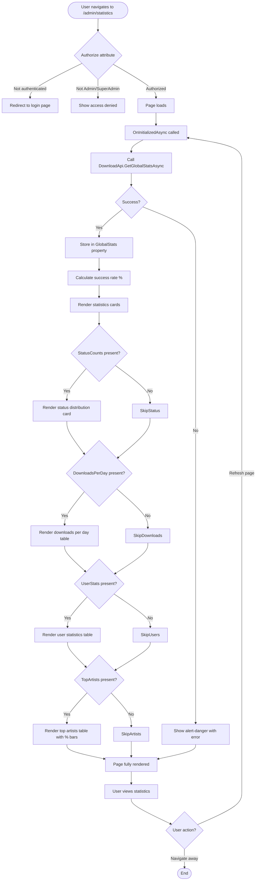
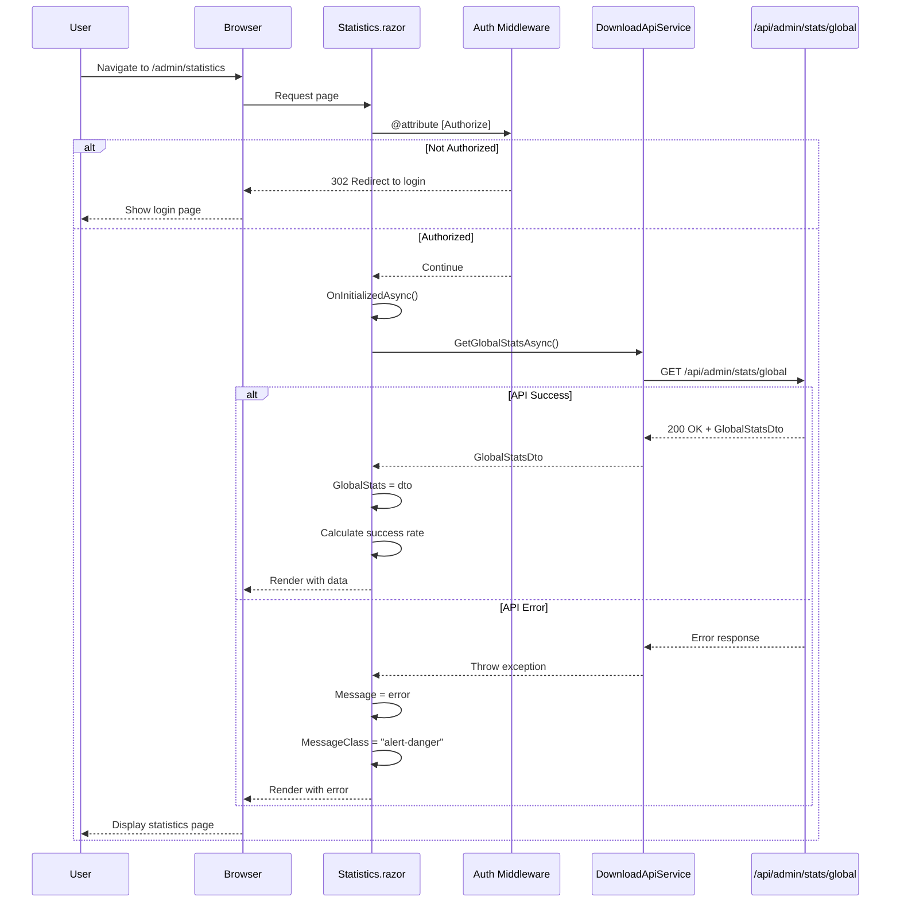

# Admin Statistics Page - Flow Diagrams (Phase 2)

**Feature:** Admin dashboard with system statistics  
**Route:** `/admin/statistics`  
**Component:** `Statistics.razor`  
**Authorization:** Admin or SuperAdmin role required  
**Created:** Retroactively (2026-03-14)  
**Status:** ✅ Implemented

---

## Diagram 1: User Journey Flowchart



---

## Diagram 2: Component & State Map

```mermaid
flowchart TD
    subgraph StatisticsPage["Statistics.razor (Page Component)"]
        subgraph StateVars["@code State Variables"]
            SV1[GlobalStats: GlobalStatsDto]
            SV2[Message: string]
            SV3[MessageClass: string]
        end
        
        subgraph ComputedProperties["Computed/Getters"]
            CP1[GetSuccessRate: calculates % from StatusCounts]
        end
        
        subgraph HelperMethods["Helper Methods"]
            HM1[GetStatusBadgeClass: returns badge class per status]
        end
        
        subgraph Lifecycle["Lifecycle"]
            LC1[OnInitializedAsync: loads data]
        end
    end
    
    subgraph Services["Injected Services"]
        S1[DownloadApiService]
        S2[ILogger&lt;Statistics&gt;]
    end
    
    subgraph External["External APIs"]
        API1[/api/admin/stats/global]
    end
    
    subgraph UI["UI Components"]
        subgraph CardsRow["Stats Cards Row (col-md-3 x 4)"]
            C1[Card: Total Downloads]
            C2[Card: Storage Used]
            C3[Card: Active Users]
            C4[Card: Success Rate]
        end
        
        subgraph OptionalCards["Conditional Cards"]
            OC1[Status Distribution]
            OC2[Downloads Per Day]
            OC3[User Statistics]
            OC4[Top Artists]
        end
        
        UI1[Alert div for errors]
    end
    
    subgraph DtoStructure["DTO Structure"]
        D1[GlobalStatsDto]
        D1 --> D1a[TotalDownloads: int]
        D1 --> D1b[TotalStorageMB: double]
        D1 --> D1c[ActiveUsersLast7Days: int]
        D1 --> D1d[StatusCounts: Dictionary&lt;string,int&gt;]
        D1 --> D1e[DownloadsPerDay: List&lt;DailyStat&gt;]
        D1 --> D1f[UserStats: List&lt;UserStatsDto&gt;]
        D1 --> D1g[TopArtists: List&lt;ArtistStat&gt;]
    end
    
    %% Data Flow
    LC1 -.calls.-> S1
    S1 -.HTTP GET.-> API1
    API1 -.returns.-> D1
    D1 -.stored in.-> SV1
    
    SV1 -.renders.-> CardsRow
    SV1 -.condition.-> OptionalCards
    
    D1d -.used by.-> CP1
    CP1 -.renders.-> C4
    
    D1d -.iterated.-> OC1
    D1e -.iterated.-> OC2
    D1f -.iterated.-> OC3
    D1g -.iterated.-> OC4
    
    API1 -.error.-> SV2/SV3
    SV2/SV3 -.renders.-> UI1
    
    HM1 -.called for each.-> OC1
```

---

## Diagram 3: Data Loading Sequence



---

## Screen Inventory

### Primary Screen
- **Statistics.razor** (`/admin/statistics`) - Admin dashboard

### Authorization Flow
- Uses `[Authorize(Roles = "Admin,SuperAdmin")]` attribute
- Redirects to login if not authenticated
- Shows access denied if wrong role

### Related Screens (Not Implemented)
- User detail view (drill-down per user)
- Real-time statistics (WebSocket/SSE updates)
- Export to CSV/Excel

---

## API Call Summary

| Action | Endpoint | Method | Timing |
|--------|----------|--------|--------|
| Load Statistics | `/api/admin/stats/global` | GET | OnInitializedAsync |

**Note:** This is a single API call that returns all statistics data (denormalized for UI efficiency).

---

## Error Handling

| Error Type | UI Feedback | Recovery |
|------------|-------------|----------|
| API unavailable | alert-danger: "Failed to load statistics" | Page refresh |
| Not authorized | Redirect to login or access denied | Contact admin |
| Partial data | Render available sections, skip missing | N/A (acceptable) |

---

## Data Flow Summary

```
┌────────────────────────────────────────────────────────────┐
│ Backend (Single Query)                                      │
│  - Total counts from DownloadJobs table                    │
│  - Storage sum from file metadata                          │
│  - Status distribution (GROUP BY Status)                   │
│  - Daily stats (GROUP BY date)                             │
│  - User stats (GROUP BY UserId)                            │
│  - Top artists (parse filenames, GROUP BY artist)          │
└────────────────────────────────────────────────────────────┘
                           ↓ HTTP GET
┌────────────────────────────────────────────────────────────┐
│ Frontend (Single DTO)                                       │
│  GlobalStatsDto contains all nested data                   │
│  - No additional API calls needed                          │
│  - All sections rendered from one object                   │
└────────────────────────────────────────────────────────────┘
                           ↓ Render
┌────────────────────────────────────────────────────────────┐
│ UI Sections                                                 │
│  1. Summary cards (computed values)                        │
│  2. Status distribution (iterate StatusCounts)             │
│  3. Daily table (iterate DownloadsPerDay)                  │
│  4. User table (iterate UserStats)                         │
│  5. Artists table (iterate TopArtists)                     │
└────────────────────────────────────────────────────────────┘
```

---

**Approval Status:** ✅ Retroactively documented (originally built without flow diagrams)
